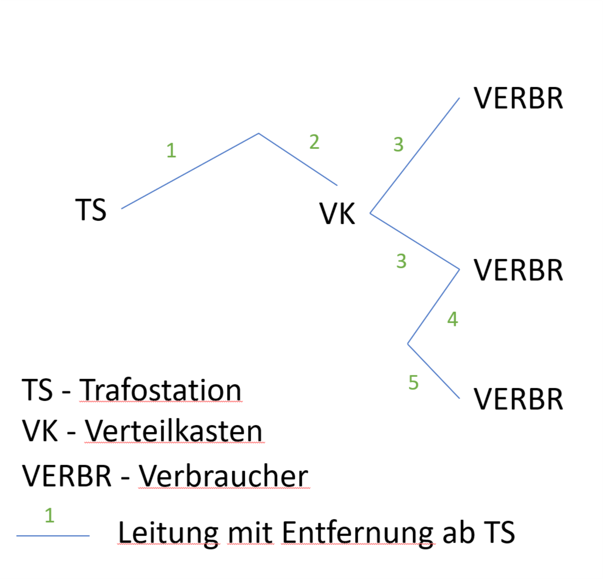
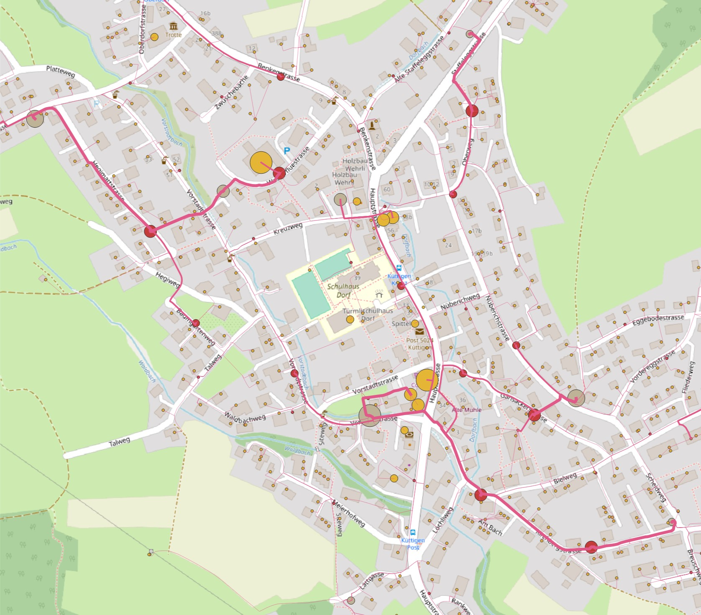
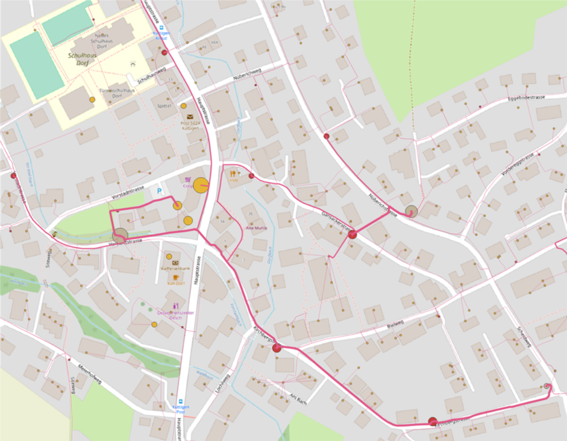
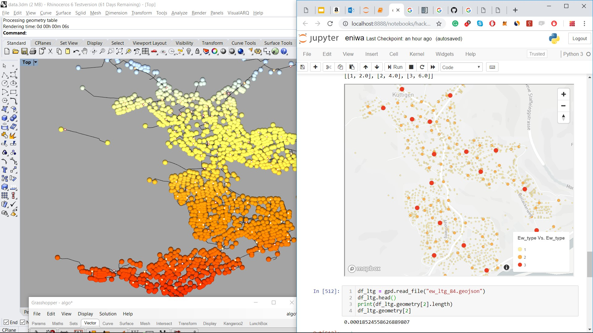

# Energie-Erneuerungsplanung
## Topic: Algorithmic solution for valuing consequences in infrastructure maintenance

This project reflects this [challenge](https://hack.opendata.ch/project/341)

### Challenge
Maintenance of company assets of the low-voltage power distribution grid should be prioritized based on asset state and asset importance. While the state of the asset, typically the age since the last maintenance, is well-document, there is currently no measure of importance for these assets. One idea to value the importance of the assets is to analyze the amount of energy that is distributed by them. The amount of consumption is, of course, not an optimal measure for how damage is caused by an asset breakdown, or for what consumer would pay for an insurance against power interupts - if they were allowed to pay for it. This challenge, therefore, leave it open how, for the purpose of optimization, the importance will be measured.

### Provided Data
The data that was provided consisted of
- List and point coordinates of transformer stations
- List and point coordinates of distribution enclosures
- List and point coordinates of consumers
- List and line coordinates of connection lines
- Anonymized consumption data for the last four years

### Approach
Since no importance measure was given, but consumption can be considered a first good proxy and consumption is only known per consumer but not per connection line, distribution enclosure or transformer station, the first part of the project was dedicated to enriching the data by calculating these figures.

The second part of the project focussed on the optimization of the prioritization of maintenance work based on a flexible importance measure.

### Data enrichment

### Optimization

